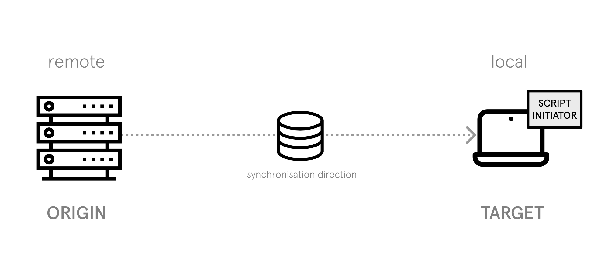
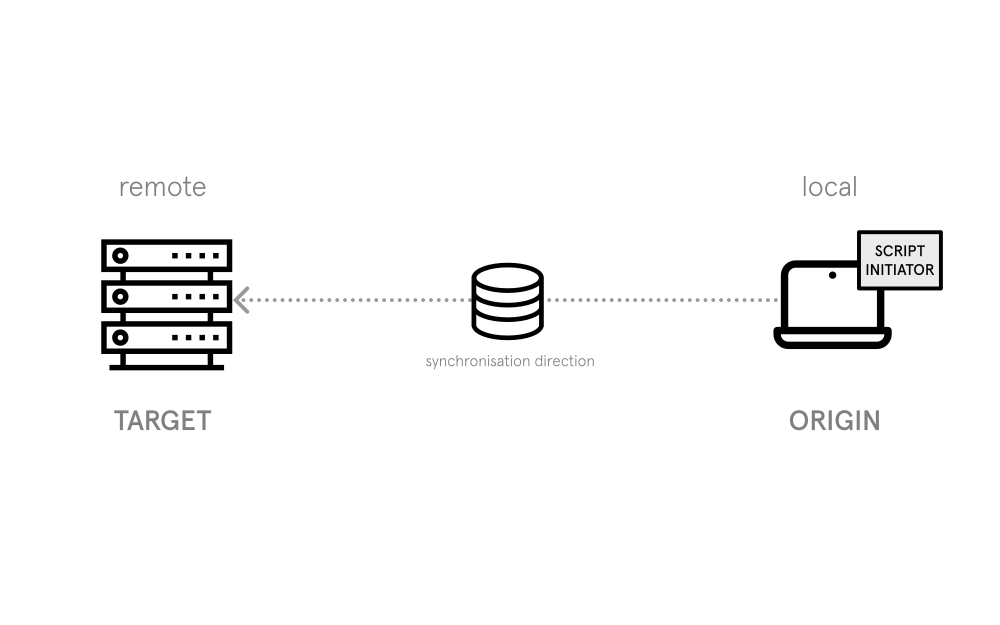
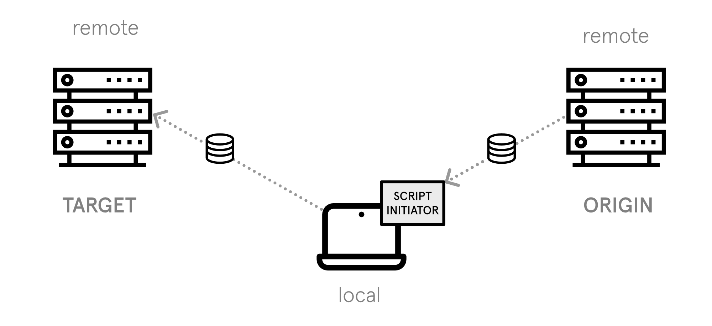
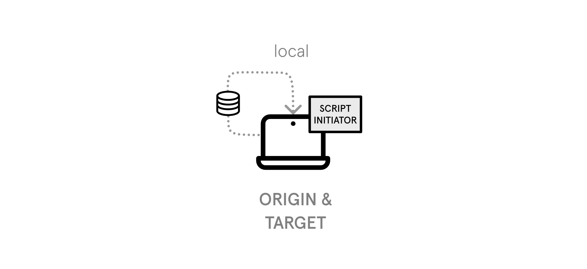
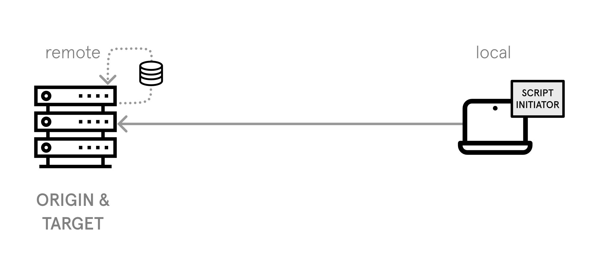
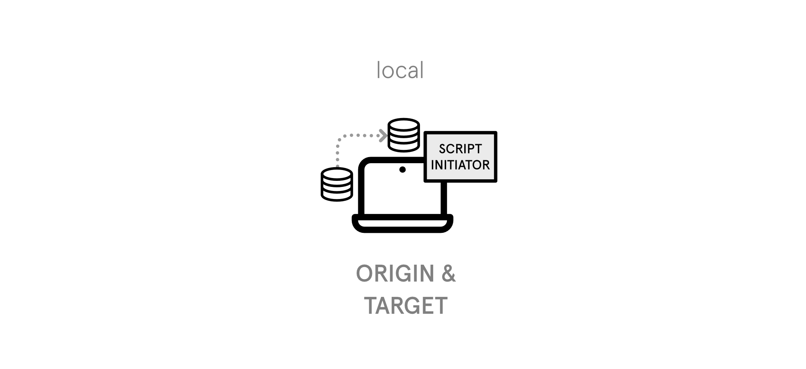
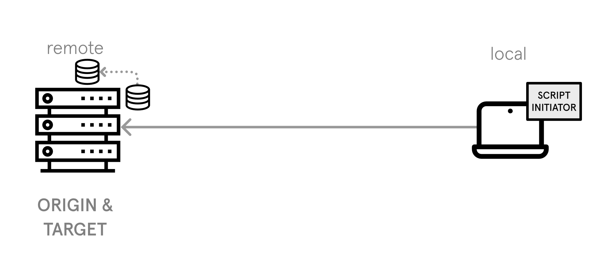

# Sync modes

It is possible to enable different kind of sync modes for the database synchronisation depending on the preferred origin (which provides the database dump) and target system (which receiving the database dump). 

The default mode is _receiver_. 

- [Receiver](#sm-receiver)
- [Sender](#sm-sender)
- [Proxy](#sm-proxy)
- [Dump Local](#sm-dump-local)
- [Dump Remote](#sm-dump-remote)
- [Import Local](#sm-import-local)
- [Import Remote](#sm-import-remote)
- [Sync Local](#sm-sync-local)
- [Sync Remote](#sm-sync-remote)

<a name="sm-receiver"></a>
## Receiver

The _receiver_ mode offers the possibility to get a database dump from a remote system (origin) to your local system (target). 



This mode is enabled, if a `host` entry is __only__ be stored in the `origin` section of the `config.yaml` configuration.

```yaml
target:
    path: <TARGET_PATH>
origin:
    host: <ORIGIN_HOST>
    user: <ORIGIN_USER>
    path: <ORIGIN_PATH>
```

<a name="sm-sender"></a>
## Sender

The _sender_ mode offers the possibility to provide a database dump from your local system (origin) to a remote system (target). 



This mode is enabled, if a `host` entry is __only__ be stored in the `target` section of the `config.yaml` configuration.

```yaml
target:
    host: <TARGET_HOST>
    user: <TARGET_USER>
    path: <TARGET_PATH>
origin:
    path: <ORIGIN_PATH>
```

<a name="sm-proxy"></a>
## Proxy

The _proxy_ mode offers the possibility to get a database dump from a remote system (origin) and store them temporarily on your local system. After that the stored database dump will be forwarded to another remote system (target).



This mode can be used, when origin and target system can't or shouldn't connect directly (because of security restrictions). So your local system acts as proxy between both of them.  

This mode is enabled, if a `host` entry is being stored in the `origin` __and__ `target` section of the `config.yaml` configuration.

```yaml
target:
    host: <TARGET_HOST>
    user: <TARGET_USER>
    path: <TARGET_PATH>
origin:
    host: <ORIGIN_HOST>
    user: <ORIGIN_USER>
    path: <ORIGIN_PATH>
```

<a name="sm-dump-local"></a>
## Dump Local

The _dump local_ mode offers the possibility to only save a database dump from your local system. This is not really a synchronisation mode, just an easy way to save a database dump on your local mashine. No file transfer or database import will be performed. You can specify the dump file location with the `dump_dir` setting in your `config.yaml`.



This mode is enabled, if _no_ `host` entry is being stored in the `target` or `origin` section of the `config.yaml` configuration.

```yaml
origin:
    path: <ORIGIN_PATH>
    dump_dir: <DUMP_DIR>
```

<a name="sm-dump-remote"></a>
## Dump Remote

The _dump local_ mode offers the possibility to only save a database dump from your local system. This is not really a synchronisation mode, just an easy way to save a database dump on a remote mashine (e.g. as backup mechanism). No file transfer or database import will be performed. You can specify the dump file location with the `dump_dir` setting in your `config.yaml`.



This mode is enabled, if the `host` entry are equal in the `target` and `origin` section of the `config.yaml` configuration.

```yaml
target:
    host: <ORIGIN_HOST>
    user: <ORIGIN_USER>
    path: <ORIGIN_PATH>
origin:
    host: <ORIGIN_HOST>
    user: <ORIGIN_USER>
    path: <ORIGIN_PATH>
    dump_dir: <DUMP_DIR>
```

<a name="sm-import-local"></a>
## Import Local

The _import local_ mode offers the possibility to only import a database dump from a local file dump. This is not really a synchronisation mode, just an easy way to import a database dump on your local mashine. No file transfer will be performed.


```yaml
target:
    path: <TARGET_PATH>
```

This mode is enabled, if you add the `-i` or `--import-file` option and specify the location of the local dump file.

```shell
$ db_sync_tool -f import-local.yaml -i /path/to/file.sql
```

<a name="sm-import-remote"></a>
## Import Remote

The _import remote_ mode offers the possibility to only import a database dump on a remote file dump. This is not really a synchronisation mode, just an easy way to import a database dump on a remote maschine. No file transfer will be performed.


```yaml
target:
    host: <TARGET_HOST>
    user: <TARGET_USER>
    path: <TARGET_PATH>
```

This mode is enabled, if you add the `-i` or `--import-file` option, specify the location of the remote dump file and the `target` in your `config.yaml` is a remote system.

```shell
$ db_sync_tool -f import-local.yaml -i /path/to/file.sql
```

<a name="sm-sync-local"></a>
## Sync Local

The _sync local_ mode offers the possibility to sync a database within your local system (origin/target). 



This mode is enabled, if no `host` entry is stored and the `path` entries differ in the `config.yaml` configuration.

```yaml
target:
    path: <TARGET_PATH>
origin:
    path: <ORIGIN_PATH>
```

<a name="sm-sync-remote"></a>
## Sync Remote

The _sync remote_ mode offers the possibility to sync a database within a remote system (origin/target). 



This mode is enabled, if the `host` entries will be the same and the `path` entries differ in the `config.yaml` configuration.

```yaml
target:
    host: <ORIGIN_HOST>
    user: <ORIGIN_USER>
    path: <TARGET_PATH>
origin:
    host: <ORIGIN_HOST>
    user: <ORIGIN_USER>
    path: <ORIGIN_PATH>
```