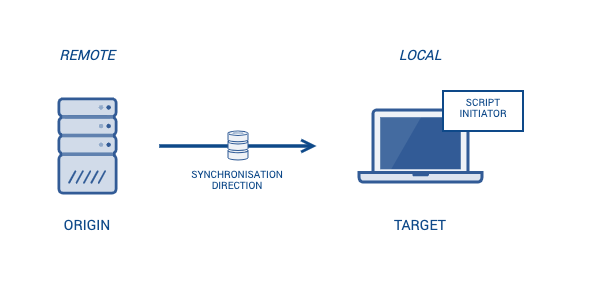
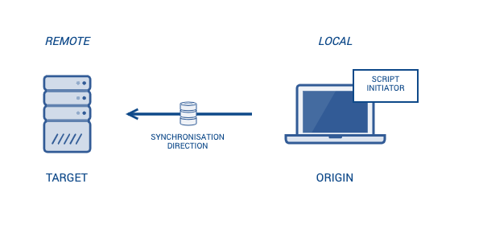

# Sync modes

It is possible to enable different kind of sync modes for the database synchronisation depending on the preferred origin (which provides the database dump) and target system (which getting the database dump). 

The default mode is _receiver_. 

## Receiver

The _receiver_ mode offers the possibility to get a database dump from a remote system (origin) to your local system (target). 

This mode is enabled, if a `host` entry is __only__ be stored in the `origin` section of the `host.json` configuration.

## Sender

The _sender_ mode offers the possibility to provide a database dump from your local system (origin) to a remote system (target). 

This mode is enabled, if a `host` entry is __only__ be stored in the `target` section of the `host.json` configuration.

## Proxy

The _proxy_ mode offers the possibility to get a database dump from a remote system (origin) and store them temporarily on your local system. After that the stored database dump will be forwarded to another remote system (target).

This mode can be used, when origin and target system can't or shouldn't connect directly (because of security restrictions). So your local system acts as proxy between both of them.  

This mode is enabled, if a `host` entry is be stored in the `origin` __and__ `target` section of the `host.json` configuration.

## Local

The _local_ mode offers the possibility to save a database dump just from your local system. No database import will be performed. You can specify the dump file location with the "keep dump" option (`--kd`).

This mode is enabled, if no `host` entry is be stored in the `target` or `origin` section of the `host.json` configuration.